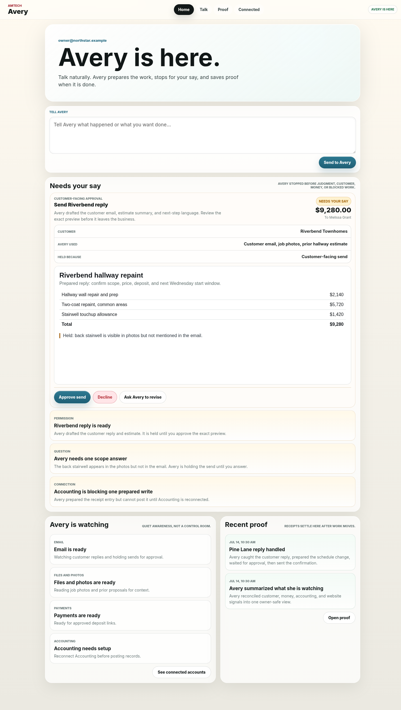
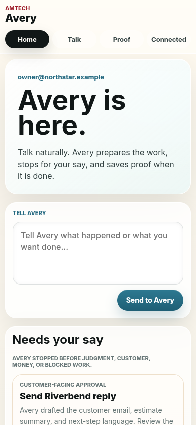
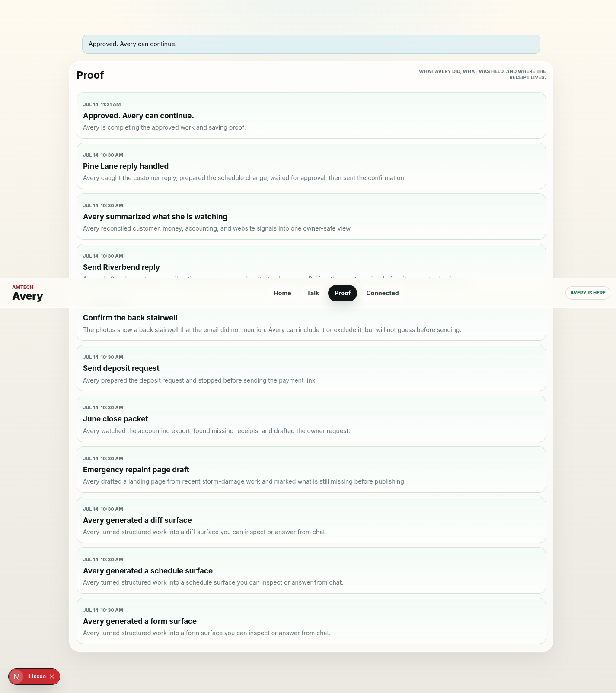
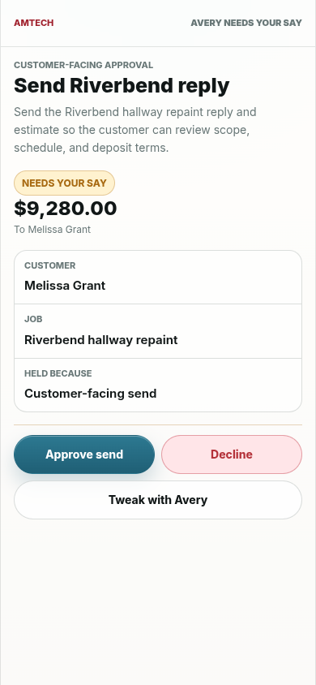

# AMTECH MVP UI Redesign Packet

Status: active design direction; owner MVP implementation source-wired 2026-07-14
Audience: implementation agents and product reviewers rebuilding owner-facing MVP surfaces
Scope: design packet plus current UI implementation handoff

This packet supersedes the previous `mvp-build/ui-redesign/` direction and the rejected chat-native
agent desktop implementation. Treat older screenshots, component layouts, stream rails, badge systems,
and column-heavy shells as historical context only.

The new product direction is simpler: the owner primarily experiences Avery, the AI employee. The
software is not a dashboard, CRM, inbox, task manager, admin console, or giant chat transcript. It is
a calm place to talk to Avery, see what needs the owner's judgment, inspect exact work before risky
actions, and find proof later.

Read [`00-index-and-reading-order.md`](00-index-and-reading-order.md) first. For cross-surface UX organization,
research ledger, implementation coverage, generative-UI frontier, and fixture/production policy, read
[`../docs/ux/`](../docs/ux/).

## Current Implementation Status

As of 2026-07-14, the owner MVP web route follows this packet in source:

- `/agent/[employeeId]` is organized around Home, Talk, Proof, and Connected.
- Home leads with Avery, Tell Avery, Needs your say, quiet Watching, and Recent proof.
- The first active permission appears inline as an exact review, while deeper objects open in the optional sheet.
- Signed mobile Review now shares the same calm approval/proof language.
- Existing contracts remain intact: `ResourcePayload`, `WorkResource`, `WorkAction`, `SurfaceEnvelope`,
  `ConnectionSurface`, `CapabilityGraphNode`, `ResurfaceItem`, signed review links, and approval gates.

No live provider/runtime acceptance is claimed by these screenshots or fixture tests.

## Screenshots

Desktop Home:

Mobile Home:

Proof:

Signed mobile Review:

## Local Proof

- `npm run test:unit -- --run tests/unit/work-surface-model.test.ts`
- `npm run typecheck --workspace @amtech/web`
- `npm run ui:test`
- `UI_FIXTURE_BASE_URL=http://127.0.0.1:3200 npm run ui:test:headed`
- `npm run typecheck`
- `npm run lint`
- `npm run test:unit`
- `npm run build`
